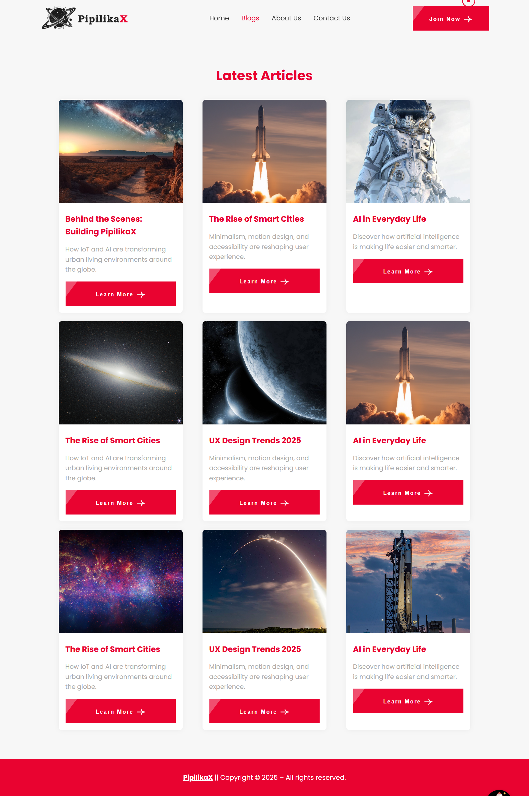
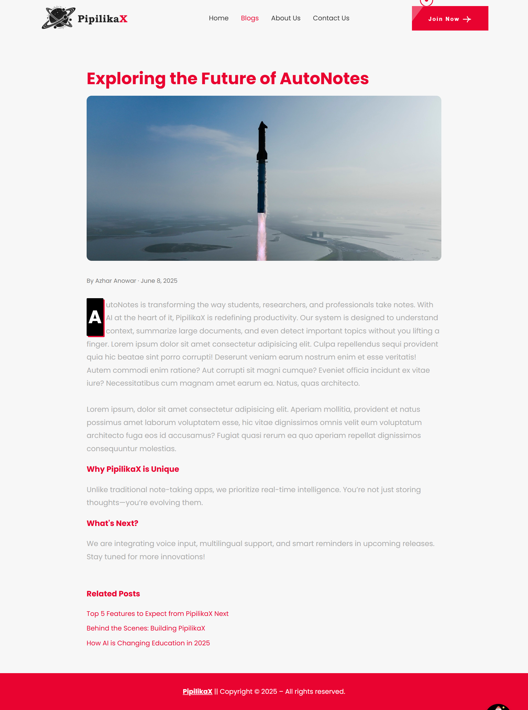
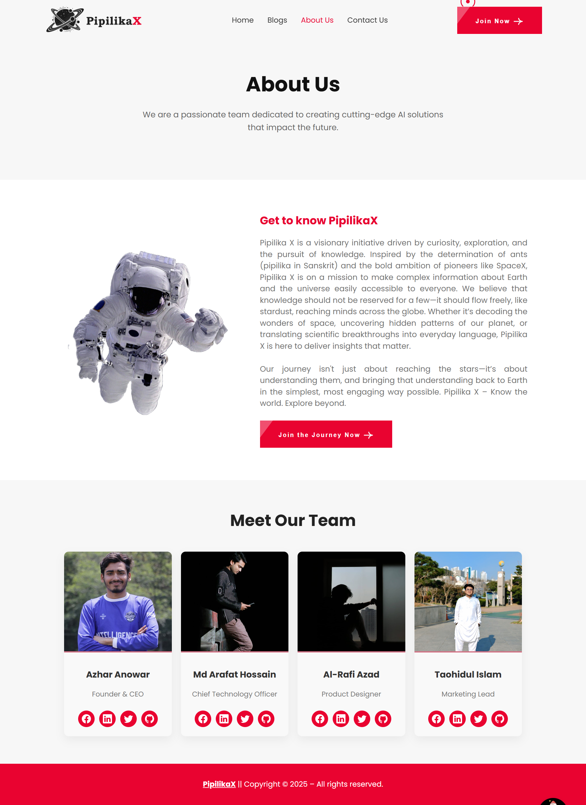
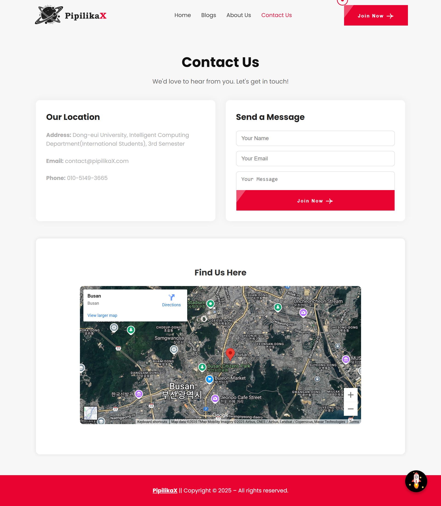
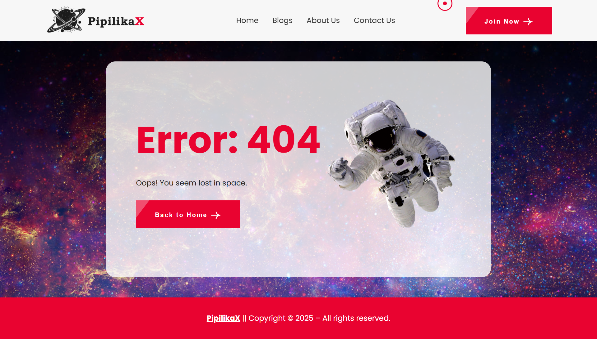

# PipilikaX 🚀

**PipilikaX** is a space, astronaut, astronomy related informational responsive web design project that delivers educational content and real-time space data in an engaging, interactive format. I design the project for learning and practice purpose with HTML5, CSS3 and JavaScript ES6 and DOM manipulation.

🌐 [Live Site](https://azharanowar.github.io/pipilikaX)

---

## 📁 Pages & Features

### 🏠 Home
- Animated **starfield** hero section (Canvas API).
- "About PipilikaX" intro section.
- Visual **solar system lineup**.
- **NASA Image of the Day** with live API and description.
- PipilikaX **carousel engine**: showcases modules or tools.
- **Live ISS Tracker**: real-time map using iframe.
- **Adventure Parallax Section** with a Mars-style image.
- "Learn More" call-to-action gallery.
- Custom **cursor animation** and **scroll-to-top** button.

### 📝 Blog Listing
- Responsive card layout using **CSS Grid**.
- Blog cards with thumbnail, summary, and Read More link.

### 📖 Blog Single Post
- Full-width hero image.
- Blog title, author, date, body content.
- Navigation and styled share buttons.

### 👨‍🚀 About Page
- Mission statement repeated from home.
- **Meet the Team**: Grid of styled member profiles with hover social links.

### ✉️ Contact Page
- Contact form with name, email, and message.
- Embedded **satellite map** iframe.
- Fully responsive design.

### ❌ 404 Page
- Full-width animated starfield background.
- Floating astronaut graphic.
- Large `404` with "Lost in Space" message.
- Button to return home.

---

## 🛠️ Technologies Used

- HTML5
- CSS3 (Flexbox, Grid, Animations)
- JavaScript (Vanilla, Canvas API)
- Responsive Design Principles
- External APIs and Iframes

---

## 🚀 Getting Started

1. Clone the repository:
   ```bash
   git clone https://github.com/azharanowar/pipilikaX.git
   cd pipilikaX
   ```
2. Open `index.html` using any live server or drag it into your browser.

3. Or [visit the GitHub Pages deployment](https://azharanowar.github.io/pipilikaX)

---

## 📸 Screenshots

> Store all screenshots in a `/screenshots/` folder and link them like below:

### Home Page  


### Blog Listing  


### Blog Post  


### About Page  


### Contact Page  


### 404 Page  


---

## 📄 License

Open-source for exploration and educational purposes.

---

## 👨‍💻 Author

Developed with ❤️ by [Azhar Anowar](https://github.com/azharanowar)  
Feedback and contributions are welcome. Submit an issue or PR!

---

🛰️ *“Explore the cosmos—one scroll at a time.”*
